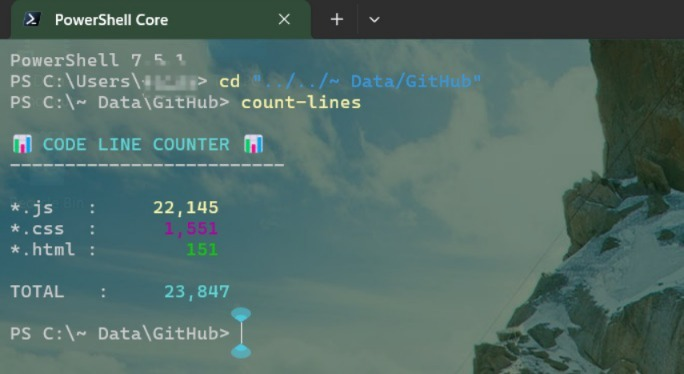

# PowerShell Navigation Utilities

This repository contains helpful PowerShell functions to improve command-line navigation and file interaction.

## Table of Contents
- [Functions](#functions)
  - [openf - Interactive File Opener](#openf---interactive-file-opener)
  - [cdx - Interactive Directory Navigator](#cdx---interactive-directory-navigator)
  - [count-lines - Code Line Counter](#count-lines---code-line-counter)
- [Installation](#installation)
- [Benefits](#benefits)
- [Requirements](#requirements)

## Functions

### `openf` - Interactive File Opener

This function displays a numbered list of all files in the current directory and allows you to open a file by selecting its number.

#### How to use:
1. Simply type `openf` in your PowerShell terminal
2. Select the file number from the list
3. The file will open in its default application


### `cdx` - Interactive Directory Navigator

This function displays a numbered list of all subdirectories in the current directory and allows you to change to a directory by selecting its number.

#### How to use:
1. Type `cdx` in your PowerShell terminal
2. Select the directory number from the list
3. Your current location will change to the selected directory


### `count-lines` - Code Line Counter

This function counts the total number of lines in web development files within the current directory and its subdirectories.

#### How to use:
1. Navigate to your project directory in PowerShell
2. Type `count-lines` in your terminal
3. View the color-coded breakdown of line counts by file extension and the total count

#### Features:
- Counts lines in JS, JSX, TS, TSX, CSS, SCSS, and HTML files
- Automatically excludes files in node_modules directories
- Shows individual counts per file type and a grand total
- Color-coded output for better readability



## Installation

To use these functions in your PowerShell profile:

1. Copy the scripts to a location of your choice
2. Edit your PowerShell profile by opening it in a text editor:
   ```powershell
   notepad $PROFILE
   ```
3. Add the following lines to your profile:
   ```powershell
   # Load openf function
   . "PATH_TO_SCRIPT\Open-File.ps1"
   
   # Load cdx function
   . "PATH_TO_SCRIPT\Change-Directory.ps1"

   # Load Count-Lines script
   . "PATH_TO_SCRIPT\Count-Lines.ps1"
   ```
4. Replace `PATH_TO_SCRIPT` with the actual path where you saved the scripts
5. Restart PowerShell or reload your profile with:
   ```powershell
   . $PROFILE
   ```

## Benefits

- No more typing long file or directory names with tab completion
- Quickly see all available files or directories in the current location
- Simple numbered selection makes navigation faster

## Requirements

- Windows PowerShell 5.1 or PowerShell Core 6.0+
- File execution policy that allows running scripts
